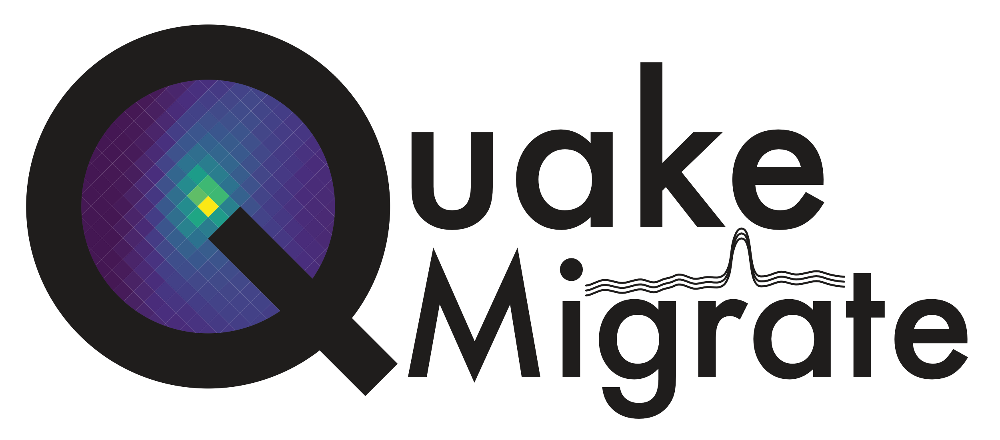

QuakeMigrate is a Python package for the detection and location of seismicity from passive seismic data using waveform migration and stacking. It can be used to produce catalogues of earthquakes, including hypocentres, origin times, phase arrival picks, and local magnitude estimates, as well as rigorous estimates of the associated uncertainties.

The package has been implemented with a modular architecture with the potential for extension and adaptation at numerous entry points, including the calculation of traveltime grids, the choice of characteristic function, and the algorithm used to perform phase picking.

Documentation
-------------
Documentation for QuakeMigrate is hosted [here](https://quakemigrate.readthedocs.io/en/development/index.html).

Installation
------------
Installation instructions can be found [here](https://quakemigrate.readthedocs.io/en/development/installation.html).

Usage
-----
We are working on tutorials covering how each individual aspect of the package works, as well as some example use cases in which we provide substantive reasoning for the parameter choices used. These examples include applications to cryoseismicity and volcano seismology.

This is a work in progress - [see our documentation for full details](https://quakemigrate.readthedocs.io/en/development/tutorials.html).

Citation
--------
If you use this package in your work, please cite the following paper:

Bacon, C.A., Smith, J.D., Winder, T., Hudson, T., Greenfield, T. and White, R.S. QuakeMigrate: a Modular, Open-Source Python Package for Earthquake Detection and Location. In AGU Fall Meeting 2019. AGU.

or, if this is not possible, please cite the following journal article:

Smith, J.D., White, R.S., Avouac, JP, and S. Bourne (2020), Probabilistic earthquake locations of induced seismicity in the Groningen region, Netherlands, Geophysical Journal International.

We hope to have a publication coming out soon:

Winder, T., Smith, J.D., Bacon, C.A., Hudson, T.S., Drew, J., Greenfield, T. and White, R.S. QuakeMigrate: a Python Package for Automatic Earthquake Detection and Location Using Waveform Migration and Stacking. Seismological Research Letters.

Contact
-------
You can contact us directly at - quakemigrate.developers@gmail.com

Any additional comments/questions can be directed to:
* **Tom Winder** - tom.winder@esc.cam.ac.uk
* **Conor Bacon** - conor.bacon@esc.cam.ac.uk

License
-------
This package is written and maintained by the QuakeMigrate developers, Copyright QuakeMigrate developers 2020. It is distributed under the GPLv3 License. Please see the [LICENSE](LICENSE) file for a complete description of the rights and freedoms that this provides the user.
