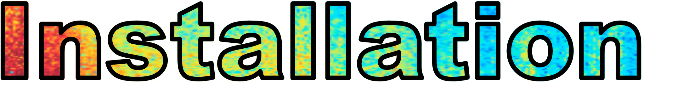

> QuakeMigrate is a Python and C software package that detects and locates seismic events from raw data, using a migration and coalescence back projection technique. The ability to fine tune the input parameters and analyse the results using a suite of visualisation functions give it an edge over the alternatives. Simple scripts (see the provided examples) allow the user to rapidly deploy the software in any seismological setting. The open source and module nature allows for the continious development with the inclusion of cutting edge techniques. 

---

QuakeMigrate is currently in prperation for publication. Once accepted we hope that the publication will have the reference: 
  
  `Smith, J.D., Winder, T., Hudson, T.S., Bacon, C., Greenfield, T., Drew, J. and R.S. White (2019), QuakeMigrate: Earthquake Onset Detection adn Back-Migration Location Method, Seismological Research Letters.`

---

Our installation process can be directly from the GitHub repository. However, we recommend that the user creates a Anaconda environment and installs the required packages using:

`conda env create -f QuakeMigrate.yml`

Once the environment is installed the user can install the software using
`git clone https://github.com/Ulvetanna`
into the required host directory. 

More information on the required version of packages can be found under the setup.py file or in the QuakeMigrate.yml file.
<!----------------------------------------------------------------------->

Outlined in this section are the main processing procedures with the parameter definitions required to run each stage of the QuakeMigrate Software. The main processing procedures can be subdivided into four stages: Travel Time, Seismic Data, Detect, Locate and Trigger. The input and outputs of each stage are represented in the Figure below. 

# Travel Time
This stage requires the formulation of a travel time look-up table from a user defined velocity model. This stage uses the submodule 'model', a distribution of classes defining the model space, and 'quakeio', a distribution of classes to read different input/output formats. Each of these modules are loaded using:

`import QMigrate.core.model as qmod`
`import QMigrate.io.quakeio as qio`

---
### Station Information
The stations used in the inversion procedure can be loaded into the system by running:
` stations = qio.stations(STATION_FILE)`
with the 'STATION_FILE' describing the path to a file of csv format with columns of Longitude,Latitude,Elevation,Station name. An example of this filetype can be found under './examples/icequake/inputs/stations.txt'.

---
### Grid definition
Once the stations are loaded, the defining the search region must be defined. This is termed the look-up table and contains information about the grid dimensions, grid cell size, central longitude and latitude, elevation, and travel-time look-up tables. Once formulated this grid can be saved. The grid is initialised by running:

` lut = qmod.LUT(stations,cell_count=[20,20,140],cell_size[100,100,20])` 

where 'stations' represents the QuakeMigrate formatted station file,  'cell_count' is the dimensions of the grid in the X,Y,Z direction, and 'cell_size' is the grid spacing in the X,Y,Z given in metres. The user must also give the central lonitude and latitude of the grid respectively by running:

` lut.lonlat_centre(-17.224, 64.328)`

To allow for the distortion of the grid we use a Lambert Conform conical projection with the Latitude paralles defined by:

`lut.lcc_standard_parallels = (64.32, 64.335)`
`lut.projections(grid_proj_type="LCC")`. 

---
### Travel-Time formulations
You have now generated the grid to define your travel-times within. The next stage is to define the velocity model input for either a Homogenous, 1D or 3D velocity model, and calculate the travel-times.

### Homegeous Velocity
Travel-times are calculated by running:

`lut.compute_homogeneous_vmodel(VP,VS)`

where `VP` and `VS` representing the float values of the P- and S-wave velocity, given in m/s.

##### 1D Velocity Model
 ... MORE INFO ...
 
##### 3D Velocity Model
 ... MORE INFO ...

---
### Saving and Loading Model
The look-up tables can be saved running:
 
` lut.save(FILE_PATH)`

and loaded by running:

` lut = cmod.LUT()`
` lut.load(FILE_PATH)`

# Travel Time

<!----------------------------------------------------------------------->

To ensure your version is working as expected, we have provided a set of examples that demonstrate the various features of QuakeMigrate. Outlined below are the three examples given with the software release. Additional examples will be gradulally uploaded to corresponding GitHub wiki pages.

To get started with the software we recomend that the user runs the 'Icequake' example, as this provides an insite into the entire processing procedure. 

### Antarctic Basal Icequakes
This example uses data recorded at a high sampling rate on ice. The velocity model is homogeneous.

### Bárðabunga-Holoraun Dyke Propagation, Iceland
This example features data from a dense local seismic network over an area of ~ 150 x 150 km in Central Iceland. It features a 1D velocity model, and extremely high earthquake rates during the 2014 Bardarbunga-Holuhraun dike intrusion.

### Kinabalu
More information to be added shortly ....

* [pandas](https://pandas.pydata.org/) - Easy-to-use data structures and data analysis tools.
* [ObsPy](https://github.com/obspy/obspy/wiki) - Python framework for processing seismological data
* [scikit-fmm](https://pythonhosted.org/scikit-fmm/) - Python extension module which implements the fast marching method
* [NumPy](http://www.numpy.org/) - NumPy is the fundamental package for scientific computing with Python
* [SciPy](https://www.scipy.org/) - Python-based ecosystem of open-source software for mathematics, science, and engineering

* **Jonathan Smith** - *Project Leader & Developer* - *Induced Seismicity, Geomechanics and Mitigating Geohazard* [Link](https://www.esc.cam.ac.uk/directory/jonathan-smith)
* **Tom Winder** - *Project Leader & Developer* - *Volcano Seismology and Earthquake Triggering* [Link](https://www.esc.cam.ac.uk/directory/tom-winder)
* **Tom Hudson**  - *Developer* - *Glacioseismology and Ice dynamics* [Link](https://www.esc.cam.ac.uk/directory/tom-s-hudson)
* **Conor Bacon** - *Developer* - *Volcano Seismology: Seismic Anisotropy* [Link](https://www.esc.cam.ac.uk/directory/conor-bacon)
* **Tim Greenfield** - *Developer* - *Volcano Seismology* [Link](https://www.esc.cam.ac.uk/directory/tim-greenfield)

Future contributors will be added to this list.

Please contact lead authors for corresponding collaboration.
* **Jonathan Smith** - jdsmith@caltech.edu
* **Tom Winder** - tebw2@cam.ac.uk

This project is licensed under the MIT License so can be used freely for academic use and non-comercial gain. Pleasesee the [LICENSE.md](LICENSE.md) file for more details.

