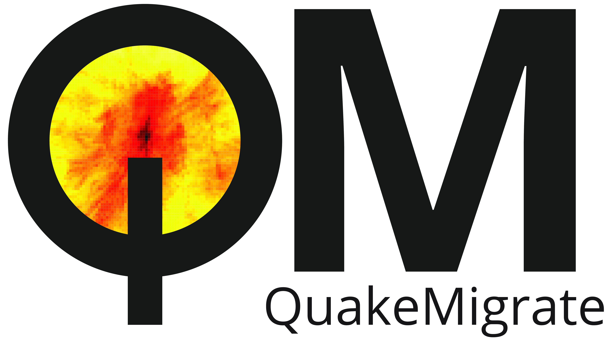

QuakeMigrate
============

:mod:`QuakeMigrate` is a Python package for the detection and location of earthquakes using waveform backprojection.

QuakeMigrate uses a waveform stacking algorithm to search for coherent seismic phase arrivals across a network of instruments. It produces, from raw data, a catalogue of earthquakes with locations, origin times and phase arrival picks, as well as estimates of the uncertainties associated with these measurements.

The source code for the project is hosted on |github|.

This package is written by the QuakeMigrate developers, and is distributed under
the MIT License, Copyright QuakeMigrate developers 2020.

.. |github| raw:: html

    <a href="https://github.com/Ulvetanna/QuakeMigrate" target="_blank">github</a>

Supported operating systems
---------------------------
We currently support Linux environments running Python 3.x. We hope to support OSX and Windows environments soon.

Tests
-----
A comprehensive suite of unit tests are in the works.

Citation
--------
If you use this package in your work, please cite the following paper:

Smith, J., Winder, T., Bacon, C., Hudson, T., Greenfield, T., White, R.S., Drew, J., QuakeMigrate: a Python package for earthquake detection and location using waveform stacking. Seismological Research Letters, `2020`.

Contents:
---------

.. toctree::
   :numbered:
   :maxdepth: 1

   installation
   tutorials
   sourcecode
