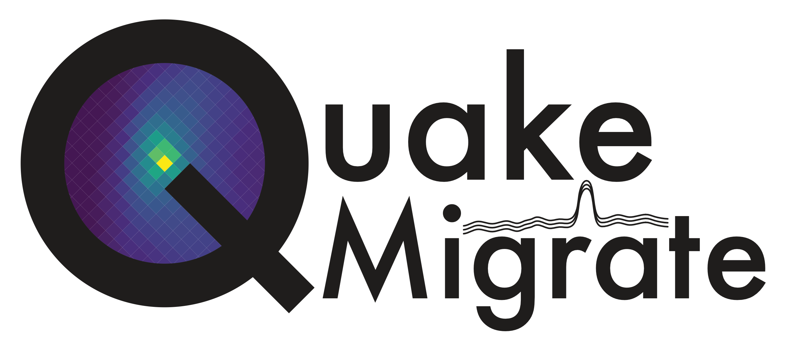

QuakeMigrate
============

:mod:`QuakeMigrate` is a Python package for automatic earthquake detection and location using waveform migration and stacking.

QuakeMigrate uses a waveform migration and stacking algorithm to search for coherent seismic phase arrivals across a network of instruments. It produces, from raw data, a catalogue of earthquakes with locations, origin times, phase arrival picks, and local magnitude estimates, as well as rigorous estimates of the associated uncertainties.

The package has been built with a modular architecture, providing the potential for extension and adaptation at numerous entry points. This includes, but is not limited to:

* the calculation or import of traveltime grids
* the choice of algorithm used to identify phase arrivals (for example by kurtosis, cross-covariance analysis between multiple components, machine learning techniques and more)
* the stacking function used to combine onset functions
* the algorithm used to perform phase picking

The source code for the project is hosted on |github|.

This package is written by the QuakeMigrate developers, and is distributed under
the GPLv3 License, Copyright QuakeMigrate developers 2020–2026.

.. |github| raw:: html

    <a href="https://github.com/QuakeMigrate/QuakeMigrate" target="_blank">GitHub</a>

Citation
--------

If you use QuakeMigrate in your work, please cite the software and the accompanying paper.

**Paper**

Winder, T., Bacon, C.A., Smith, J.D., Hudson, T.S., and White, R.S. (2026).
QuakeMigrate: a Python Package for Automatic Earthquake Detection and Location Using Waveform Migration and Stacking.
*Seismica*, 5(1).
`https://doi.org/10.26443/seismica.v5i1.1854 <https://doi.org/10.26443/seismica.v5i1.1854>`_

**Software**

Please also cite the relevant QuakeMigrate software release on Zenodo:

`https://doi.org/10.5281/zenodo.4442748 <https://doi.org/10.5281/zenodo.4442748>`_

Full citation metadata is provided in the repository's `CITATION.cff` file.

Contact
-------

You can contact the QuakeMigrate developers directly at [quakemigrate.developers@gmail.com](mailto:quakemigrate.developers@gmail.com).

Additional comments and questions can be directed to:

* **Tom Winder** - [tom.winder@esc.cam.ac.uk](mailto:tom.winder@esc.cam.ac.uk)
* **Conor Bacon** - [conor.bacon@norsar.no](mailto:conor.bacon@norsar.no)

License
-------
This package is written and maintained by the QuakeMigrate developers, Copyright QuakeMigrate developers 2020–2026. It is distributed under the GPLv3 License. Please see the `LICENSE <https://www.gnu.org/licenses/gpl-3.0.html>`_ for a complete description of the rights and freedoms that this provides the user.

Contents:
---------

.. toctree::
   :numbered:
   :maxdepth: 1

   installation
   tutorials
   sourcecode
