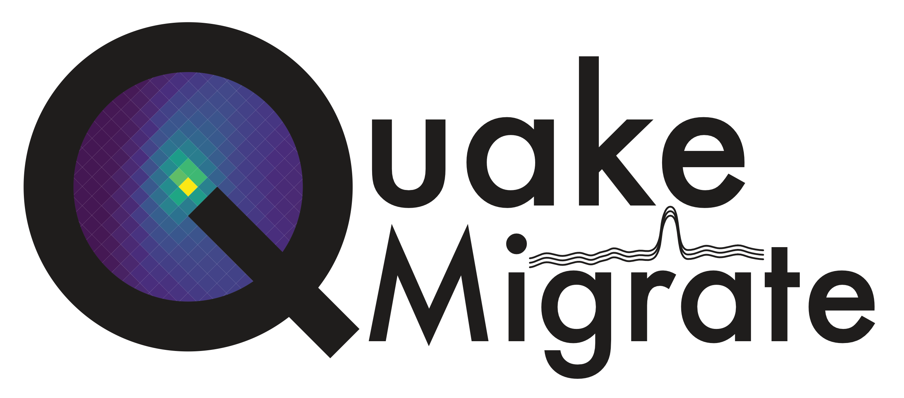

QuakeMigrate
============

:mod:`QuakeMigrate` is a Python package for the detection and location of earthquakes using waveform migration and stacking.

QuakeMigrate uses a waveform stacking algorithm to search for coherent seismic phase arrivals across a network of instruments. It produces, from raw data, a catalogue of earthquakes with locations, origin times and phase arrival picks, as well as estimates of the uncertainties associated with these measurements.

The source code for the project is hosted on |github|.

This package is written by the QuakeMigrate developers, and is distributed under
the GPLv3 License, Copyright QuakeMigrate developers 2020.

.. |github| raw:: html

    <a href="https://github.com/QuakeMigrate/QuakeMigrate" target="_blank">github</a>

Supported operating systems
---------------------------
QuakeMigrate was developed and tested on Ubuntu 16.04/18.04, with the intention of being "platform agnostic". As of July 2020, the package has been successfully built and run on:

- Ubuntu 16.04/18.04/20.04
- Red Hat Enterprise Linux
- Windows 10
- macOSX High Sierra 10.13.6

Citation
--------
If you use this package in your work, please cite the following paper:

Bacon, C.A., Smith, J.D., Winder, T., Hudson, T., Greenfield, T. and White, R.S. QuakeMigrate: a Modular, Open-Source Python Package for Earthquake Detection and Location. In AGU Fall Meeting 2019. AGU.

or, if this is not possible, please cite the following journal article:

Smith, J.D., White, R.S., Avouac, JP, and S. Bourne (2020), Probabilistic earthquake locations of induced seismicity in the Groningen region, Netherlands, Geophysical Journal International.

We hope to have a publication coming out soon:

Winder, T., Smith, J.D., Bacon, C.A., Hudson, T.S., Drew, J., Greenfield, T. and White, R.S. QuakeMigrate: a Python Package for Automatic Earthquake Detection and Location Using Waveform Migration and Stacking. Seismological Research Letters.

Contact
-------
You can contact us directly at - quakemigrate.developers@gmail.com

Any additional comments/questions can be directed to:
* **Tom Winder** - tom.winder@esc.cam.ac.uk
* **Conor Bacon** - conor.bacon@esc.cam.ac.uk

License
-------
This package is written and maintained by the QuakeMigrate developers, Copyright QuakeMigrate developers 2020. It is distributed under the GPLv3 License. Please see the [LICENSE](LICENSE) file for a complete description of the rights and freedoms that this provides the user.

Contents:
---------

.. toctree::
   :numbered:
   :maxdepth: 1

   installation
   tutorials
   sourcecode
