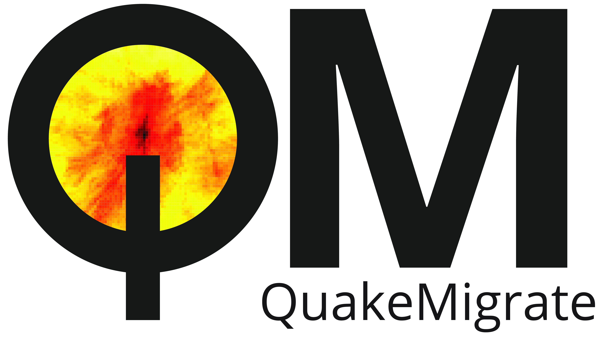

QuakeMigrate
============

:mod:`QuakeMigrate` is a Python package for the detection and location of earthquakes.

QuakeMigrate uses an efficient, parallelised waveform stacking algorithm, implemented in C, to search for coherent seismic phase arrivals across a network of instruments. It produces, from raw data, a catalogue of earthquakes with locations, origin times and phase arrival picks, as well as estimates of the uncertainties associated with these measurements.

The source code for the project is hosted on |github|.

This package is written by the QuakeMigrate developers, and is distributed under
the MIT License, Copyright QuakeMigrate developers 2019.

.. |github| raw:: html

    <a href="https://github.com/Ulvetanna/QuakeMigrate" target="_blank">github</a>

Citation
--------
If you use this package in your work, please cite the following paper:

Smith, J., Winder, T., Hudson, T., Bacon, C., Greenfield, T., White, R.S., Drew, J., QuakeMigrate: a Python package for earthquake detection and location using waveform stacking. Seismological Research Letters, `2020`.

Contents:
---------

.. toctree::
   :numbered:
   :maxdepth: 2
   
   introduction
   installation
   tutorials
   references
   sourcecode
