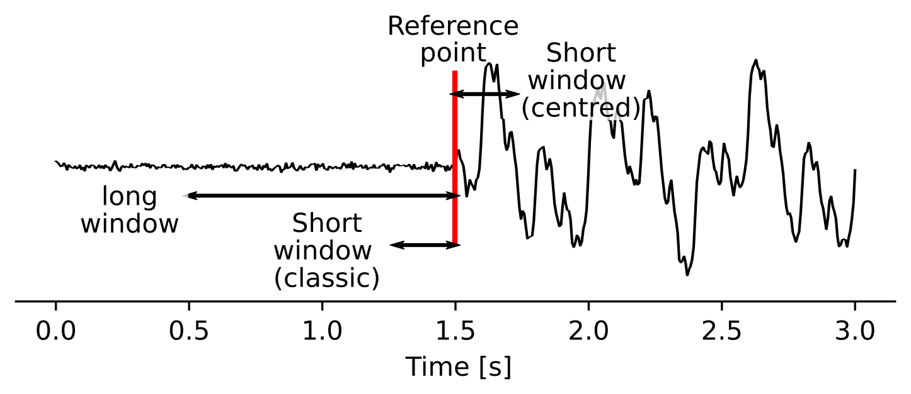

Detect
======
This tutorial will cover the basic ideas and definitions underpinning the initial stage of a QuakeMigrate run - Detect.

During this stage, the waveform data is continuously migrated through your travel time lookup tables (LUTs) to generate a coalescence function through time. This function records the x, y, z position of maximum coalescence in your volume for each timestep. Peaks in this function are then used during the `trigger` stage to identify events.

The migration of the data is performed for each node and timestep in a 4D sense and can be very computationally demanding. For this reason, it is typical to decimate the LUT to reduce the computation time. Multi-core machines or HPC clusters can also be used to split the time period and perform the computation in parallel.

Before you start
----------------
You will need an archive of waveform files organised into a regular structure (see the :class:`Archive <https://quakemigrate.readthedocs.io/en/docs-tutorials/tutorials/archive.html>`_), a traveltime LUT (as generated in the previous tutorial) and a station file (as used to generate the LUT). You will also need to choose a location to store your results and a name for your run. QuakeMigrate will automatically generate an output structure to store all your results and place this in a folder (named by the run name) in your chosen location. You may well run QuakeMigrate many times before you reach the final set of parameter values which produce the best results. It is therefore recommended you devise a naming scheme to help you distinguish between your trials. Information on the parameters for each run can be found at the head of the corresponding log file.

.. note:: The output directory and run names are used to link the outputs from one stage to the next. As such, you must be consistent across ``detect``, ``trigger``, and ``locate`` for a full run.

We proceed by defining these parameters as variables.

::

    from quakemigrate.io import read_stations

    archive_path = "/path/to/archived/data"
    lut_file = "/path/to/lut_file"
    station_file = "/path/to/station_file"

    run_path = "/path/to/output"
    run_name = "name_of_run"
    
    stations = read_stations(station_file)

Detect runs on continuous data between two defined timestamps. Internally, QuakeMigrate uses `UTCDateTime <https://docs.obspy.org/packages/autogen/obspy.core.utcdatetime.UTCDateTime.html>`_ (from ObsPy) to parse the timestamps, so your start- and endtime strings can be in any form compatible with this :class:`UTCDateTime`, such as:

::

    starttime = "2018-001T00:00:00.0"
    endtime = "2018-002T00:00:00.0"

The waveform archive is defined using an :class:`Archive` object (`see Archive tutorial <https://quakemigrate.readthedocs.io/en/docs-tutorials/tutorials/archive.html>`_) and the saved LUT can be loaded using the :func:`quakemigrate.io.read_lut` function.

::

    from quakemigrate.io import Archive, read_lut

    
    archive = Archive(archive_path=archive_path, stations=stations,
                  archive_format="YEAR/JD/STATION")
    lut = read_lut(lut_file=lut_out)

Decimation of the LUT
---------------------
To reduce computation time the decimation functionality of the LUT can be used. This reduces the number of nodes at which the coalescence is calculated resulting in a spatially low-pass filtered coalescence function. This is reasonable when we use the data for earthquake detection, but should be carefully considered if the locations output from a decimated grid are to be relied upon.

Typically, the final node spacing of your decimated grid should be similar to the expected uncertainty on your earthquake location. For the example below, the raw LUT has a node spacing of 0.5 km. After decimation, the node spacing is 2.5 km in the horizontal directions and 2 km in the vertical direction. These are good starting values for a local seismic network with an aperture of 20 - 80 km.

::

    lut = lut.decimate([5, 5, 4])

Using an Onset Function
-----------------------
Waveform data is initially pre-processed in a standard fashion - the data is linearly detrended, demeaned, and a cosine taper is applied before a zero phase-shift Butterworth bandpass filter - before being transformed into an onset function.

The onset function should (if correctly specified) peak at the arrival time of a seismic phase, representing the likelihood and quality of a phase arrival being recorded at any given instant. This function acts to simplify the seismic wavefield recorded by your instruments so the migration and stacking process work more reliably with noisy data or inaccurate velocity models. The correct choice of bandpass filters maximises the signal-to-noise ratio of your desired arrivals thereby maximising the coalescence value of any migrated earthquake.

Deciding your Onset Function
############################
QuakeMigrate currently ships with one option to use as an onset function (:class:`STALTAOnset`)). Custom functions are easily added to QuakeMigrate and are discussed in a further tutorial. 

::

    from quakemigrate.signal.onset import STALTAOnset

    onset = STALTAOnset(position="classic")

The STALTA function is the ratio between the average value in a short window to the average value in a longer window. In theory, if your window lengths are well-chosen, this function should peak at the arrival time of a seismic phase. The :class:`STALTAOnset` function that ships with QuakeMigrate takes a keyword argument (``position``) which specifies the window position relative to the reference point (see image below).

When the ``classic`` configuration is chosen, QuakeMigrate will use the :func:`classic_sta_lta` `from ObsPy <https://docs.obspy.org/packages/autogen/obspy.signal.trigger.classic_sta_lta.html>`_ where both windows are behind the current timestamp. This is the more usual formulation as it is causal (i.e. doesn't rely on future data to generate the value at a particular time). In contrast, the ``centred`` argument will place the short window ahead of the current timestamp, as to maximise the signal-to-noise ratio. 

Experience has suggested that during the `detect` stage the ``classic`` option produces more robust results because it is more stable in the presence of non-seismic noise (e.g. signal offsets due to recording issues). During the `locate` stage it is often better to use the ``centred`` argument as the resulting peaks in the coalescence function will be higher, less broad, and more consistent with the underlying theory. 

Defining a good filter
######################
Prior inspection of your recorded data before analysis is strongly recommended to help choose the optimal filter band. Users can use tools such as `Probabilistic Power Spectral Densities <https://docs.obspy.org/tutorial/code_snippets/probabilistic_power_spectral_density.html>`_ to characterise the noise across the network. If some event origin times are known then `spectrograms <https://docs.obspy.org/packages/autogen/obspy.imaging.spectrogram.spectrogram.html#obspy.imaging.spectrogram.spectrogram>`_ or `amplitude spectra <https://numpy.org/doc/stable/reference/generated/numpy.fft.rfft.html>`_ can be calculated to analyse the typical frequency content of the noise and signal. 

::

    # [lowcut (Hz), highcut (Hz), corners]
    onset.bandpass_filter = {
        "P": [2, 9.9, 2]
        "S": [2, 9.9, 2]
    }

High- and low-cut frequencies can be defined for both P- and S-waves separately and are defined in Hertz. Typically S-waves have lower frequency content than P-waves and the horizontal components may have a different seismic-noise frequency content to the vertical component.

For volcano-tectonic or microseismicity recorded across a local network, good starting values are 2 Hz for the low-cut corner and 10 - 16 Hz for the high-cut corner. These values remove most of the seismic noise associated with the oceanic microseism (periods > 7 s) and reduce high-frequency anthropogenic seismic noise.

.. note:: QuakeMigrate uses a Butterworth filter with customisable high- and low-corners. The filter is applied both forwards and backwards to remove any phase shifts. As such, the effective order is double the user-defined order.

.. note:: Remember to check the Nyquist frequency of your data. An exception will be thrown if you try to filter at frequencies greater than the Nyquist.

Window lengths
##############
In combination with your filter choice, the choice of window length is the most important parameter in producing high-quality results. As when specifying the filter parameters, you can choose to specify different window parameters for P- and S-phases to account for differences in their frequency content and/or noise value. 

::

    # [length of short window (s), length of long window (s)]
    onset.sta_lta_windows = {
        "P": [0.2, 1.5],
        "S": [0.2, 1.5]
    }

A good place to start is to choose a short window length equal to 2-3 times the dominant period of the signal you are hoping to capture. The long window values are then much longer than the short window. Typical values are 5-10 times the length of the short window. 

When choosing your parameters, you should experiment with different values using your data before running a `detect` run. A good way to do this is to use a combination of the :class:`Archive` and :class:`STALTAOnset` classes to grab sections of data from your archive and apply different filter and STALTA parameters to it. The data can be manipulated and displayed using `matplotlib <https://matplotlib.org/>`_ as in the example below.

::

    import matplotlib.pyplot as plt
    from quakemigrate.signal.onsets import STALTAOnset
    from quakemigrate.io import Archive, read_stations

    # define an archive object
    archive_path = "/path/to/archived/data"
    station_file = "/path/to/station_file"
    stations = read_stations(station_file)
    archive = Archive(
        archive_path=archive_path,
        stations=stations,
        archive_format="YEAR/JD/STATION"
    )
                    
    # Read a snippet of data (ideally around a known event)
    starttime = "2018-001T10:00:00.0"
    endtime = "2018-001T10:05:00.0"
    data = archive.read_waveform_data(starttime, endtime, sampling_rate)

    # Define the onset function
    onset = STALTAOnset(sampling_rate=sampling_rate, position="classic")
    onset.bandpass_filter = {
        "P": [2, 9.9, 2]
        "S": [2, 9.9, 2]
    }
    onset.sta_lta_windows = {
        "P": [0.2, 1.5],
        "S": [0.2, 1.5]
    }

    # Apply the onset function to the data snippet
    onset_data = onset.calculate_onsets(data)

    # Onset data is a numpy array of the P and S onsets
    # to plot the Z-component of the first station
    fig, axs = plt.subplots(nrows=3, ncols=1, constrained_layout=True)

    raw_waveform = data.signal[0, 0, :]
    filtered_waveform = data.filtered_signal[0, 0, :]
    onset_waveform = onset_data[0, :]
    time = data.times()

    axs[0].plot(time, raw_waveform, 'k-')
    axs[0].set_xlabel('Time [s]')
    axs[0].set_title('Raw data')

    axs[1].plot(time, filtered_waveform, 'k-')
    axs[1].set_xlabel('Time [s]')
    axs[1].set_title('Filtered data')
    
    axs[2].plot(time, onset_data, 'k-')
    axs[2].set_xlabel('Time [s]')
    axs[2].set_ylabel('signal-to-noise ratio')
    axs[2].set_title('Onset function')

    plt.show()

`Detect` parameters
-------------------
The `detect` stage of QuakeMigrate takes relatively few parameters which the user should set before starting the run. These mostly affect the runtime of the detect run and optimising them can dramatically reduce the overall compute time. 

::

    from quakemigrate import QuakeScan

    scan = QuakeScan(
        archive,
        lut,
        onset=onset,
        run_path=run_path,
        run_name=run_name,
        log=True,
        loglevel="info"
    )
    scan.sampling_rate = 20
    scan.timestep = 120.
    scan.threads = 12

The ``sampling_rate`` should be chosen to be the minimum possible given your chosen filter/signal frequency content as a coalescence grid is calculated for each sample. In this case filtering between 2 - 10 Hz was best so one can decimate 100 Hz data to 20 Hz. 

The ``timestep`` parameter is used to balance between reducing the number of times data is requested from the :class:`Archive` object and the memory capacity of your machine. As reading data from the hard drive is slow, and limited to one processor, the number of times this is requested should be minimised. However, reading large chunks of waveform data can quickly fill your computer's RAM, dramatically slowing the calculation.

Finally, the ``threads`` parameter controls the number of CPU threads you wish to make available for detect to use when migrating and stacking the waveform data. If you wish to use your computer for other work while running QuakeMigrate, you may find it useful to leave some of your cores free.

Starting your Detect run
------------------------

::

    scan.detect(starttime, endtime)

`Detect` is called using this command and the waveform archive is scanned between the start and end time in chunks of length ``timestep``. A log will be printed to `STDOUT` which summarises the chosen parameters for your run. As the calculation proceeds the chunk of time currently being analysed will be printed to the screen with the amount of time taken to perform the calculation for that chunk.

Common Errors
-------------
The errors output from QuakeMigrate should be self-explanatory. See below for some of the specific errors associated with the `detect` stage.

`ArchiveEmptyException`
#######################
This common error is output if your `Archive` object doesn't return any data for the time period requested. Check your data archive and time period requested.

Understanding the output from `detect`
--------------------------------------
`Detect` creates 3 output directories containing station availability data, logs and the primary output used for the subsequent `trigger` stage, the `scanmseed` object.

Station availability
####################
This is a .csv file created for each day requested and placed in the output directory in a folder named `detect/availability`. It is a simple csv file recording whether a station has data available and no gaps during each timestep. This can be used to quickly assess the configuration of your seismic network. 

::

    ,STATION1_P,STATION2_P,STATION3_P,STATION1_S,STATION2_S,STATION3_S
    2014-06-29T18:41:55.000000Z,1,1,1,1,1,1
    2014-06-29T18:41:55.750000Z,1,1,1,1,0,1
    2014-06-29T18:41:56.500000Z,1,1,0,1,1,1

Logfile
#######
The files in this directory store the screen output from each `detect` run. These are written to file by default, but if you don’t want/need this output you can set ``log=False`` when initialising the :class:`QuakeScan` object.

`Scanmseed` object
##################
The :class:`ScanmSEED` object is the primary output from the `detect` stage and is used as the input for the `trigger` stage. It is a miniSEED object containing 5 traces with data at the same sample rate as requested for the input:

1. The maximum coalescence value of the grid.
2. The maximum coalescence value of the grid normalised by the mean value of the entire grid
3. The X, Y and Z position of maximum coalescence

By using the miniSEED file format it is possible to read the outputs using the same methods as for waveform data. For example, you can easily read and plot the coalescence function using:

::

    from obspy import read

    st = read('path/to/file.scanmseed')
    print(st)

    # > Should display the following
    # 5 Trace(s) in Stream:
    # NW.COA..   | 2014-06-29T18:41:55.000000Z - 2014-06-29T18:42:20.498000Z | 500.0 Hz, 12750 samples
    # NW.COA_N.. | 2014-06-29T18:41:55.000000Z - 2014-06-29T18:42:20.498000Z | 500.0 Hz, 12750 samples
    # NW.X..     | 2014-06-29T18:41:55.000000Z - 2014-06-29T18:42:20.498000Z | 500.0 Hz, 12750 samples
    # NW.Y..     | 2014-06-29T18:41:55.000000Z - 2014-06-29T18:42:20.498000Z | 500.0 Hz, 12750 samples
    # NW.Z..     | 2014-06-29T18:41:55.000000Z - 2014-06-29T18:42:20.498000Z | 500.0 Hz, 12750 samples

    st[0].plot()

Storing the data as miniSEED files not only makes it easy to plot and manipulate the data using ObsPy, but also enables us to use miniSEEDs impressive compression routines (STEIM1/2) to efficiently store large volumes of data. To facilitate this, we store values in the scanmseed file as integers, retaining the original float point values to some fixed precision. These are: 5 for the two coalescence traces, 6 for X and Y. The depth (Z) is stored to the nearest millimetre, the exact number depending on your choice of units for the LUT. To return the values stored in the `scanmseed` object to the real values, divide each trace by the appropriate factor.
