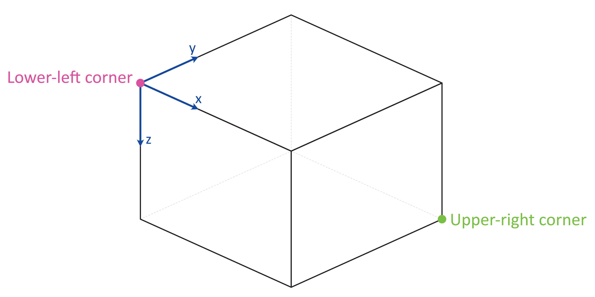

The traveltime lookup table
===========================
This tutorial will cover the basic ideas and definitions underpinning the traveltime lookup table, as well as showing how they can be created.

In order to reduce computational costs during runtime, we pre-compute traveltime
lookup tables (LUTs) for each seismic phase and each station in the network to every point in a 3-D grid. This grid spans the volume of interest, herein termed the coalescence volume, within which QuakeMigrate will search for events.

Defining the underlying 3-D grid
--------------------------------
Before we can create our traveltime lookup table, we have to define the underlying 3-D grid which spans the volume of interest.

Coordinate projections
######################
First, we choose a pair of coordinate reference systems to represent the input coordinate space (``cproj``) and the Cartesian grid space (``gproj``). We do this using `pyproj`, which provides the Python bindings for the PROJ library. It is important to think about which projection is best suited to your particular study region. More information can be found [in their documentation](https://pyproj4.github.io/pyproj/stable/).

.. warning:: The default units of :class:`Proj` are `metres`! It is strongly advised that you explicitly state which units you wish to use.

We use here the WGS84 reference ellipsoid (used as standard by the Global Positioning System) as our input space and the Lambert Conformal Conic projection to form our Cartesian space. The units of the Cartesian space are specified as kilometres. The values used in the LCC projection are for a study region in Sabah, Borneo.

::

	from pyproj import Proj

	cproj = Proj(proj="longlat", ellps="WGS84", datum"=WGS84", no_defs=True)
	gproj = Proj(proj="lcc", lon_0=116.75, lat_0=6.25, lat_1=4.0, lat_2=7.5,
	         datum="WGS84", ellps="WGS84", units="km", no_defs=True)

Geographical location and spatial extent
########################################
In order to geographically situate our lookup table, we choose two reference points in the input coordinate space, herein called the lower-left and upper-right corners (``ll_corner`` and ``ur_corner``, respectively). By default, we work in a depth-positive frame (i.e. positive-down or left-handed coordinate system) and use units of kilometres. It is possible to run QuakeMigrate with distances measured in metres, as long as the user specifies this requirement when defining the grid projection and all inputs (station elevations, grid specification, etc) are in metres.

This schematic shows the relative positioning of the two corners:

The final piece of information required to fully define the grid on which we will compute traveltimes is the size (in each dimension, `x`, `y`, `z`) of a cell (``cell_size``). The LUT class will automatically find the number of cells required in each dimension to span the specified geographical region. If a cell dimension doesn't fit into the corresponding grid dimension an integer number of times, the location of the upper-right corner is shifted to accommodate an additional cell.

::

	ll_corner = [116.075, 5.573, -1.750]
	ur_corner = [117.426, 6.925, 27.750]
	cell_size = [0.5, 0.5, 0.5]

Bundling the grid specification
###############################
The grid specification needs to be bundled into a dictionary to be used as an input for the `compute_traveltimes` function. We use here the :class:`AttribDict` from ObsPy, which extends the standard Python `dict` data structure to also
have `.`-style access.

::

    grid_spec = AttribDict()
    grid_spec.ll_corner = ll_corner
    grid_spec.ur_corner = ur_corner
    grid_spec.cell_size = cell_size
    grid_spec.grid_proj = gproj
    grid_spec.coord_proj = cproj

Computing traveltimes
---------------------
We have bundled a few methods of computing traveltimes into QuakeMigrate.

In addition to the grid specification, we need to provide a list of stations for which to compute traveltime tables.

::

    from QMigrate.io import read_stations

    stations = read_stations("/path/to/station_file")

The `read_stations` function is a passthrough for `pandas.read_csv`, so we can handle any delimiting characters (e.g. by specifying `read_stations("station_file", delimiter=",")`). There are four required (case-sensitive) column
headers - "Name", "Longitude", "Latitude", "Elevation".

.. warning:: Note: station elevations are in the positive-up/right-handed coordinate frame. An elevation of 2 would correspond to 2 (km) above sea level.

The `compute_traveltimes` function used in the following sections returns a lookup table (a fully-populated instance of the LUT class) which can be used for `detect`, `trigger`, and `locate`.

Homogeneous velocity model
##########################
Simply calculates the straight line traveltimes between stations and points in the grid. It is possible to use stations that are outside the specified span of the grid if desired. For example, if you have a good prior constraint on the possible location of the seismicity you are hoping to detect; for basal icequakes you may limit the LUT grid to span a small range of depths around the ice-bed interface. Any reduction in grid size can greatly reduce the computational cost of running QuakeMigrate, as runtime scales with the number of cells - so `n^3` for an equidimensional lookup table grid of side-length `n`.

::

    from QMigrate.lut import compute_traveltimes

	compute_traveltimes(grid_spec, stations, method="homogeneous", vp=5., vs=3.,
	                    log=True, save_file=/path/to/save_file)

Fast-marching method
####################
The fast-marching method implicitly tracks the evolution of the wavefront. Our current backend is the `scikit-fmm` package. It is possible to use this package to compute traveltimes to 1-D, 2-D, or 3-D velocity models. Currently we provide a utility function that computes traveltime tables for 1-D velocity models. The format of this velocity model file is specified below. See the `scikit-fmm` documentation and Rawlinson & Sambridge (2005) for more details.

.. note:: Traveltime calculation can only be performed between grid nodes: the station location is therefore taken as the closest grid node. Note that for large cell sizes this may cause a modest error in the calculated traveltimes.

.. note:: All stations must be situated within the grid on which traveltimes are to be computed.

::

	from QMigrate.lut import compute_traveltimes
	from QMigrate.io import read_vmodel

	vmod = read_vmodel("/path/to/vmodel_file")
	compute_traveltimes(grid_spec, stations, method="1dfmm", vmod=vmod,
	                    log=True, save_file=/path/to/save_file)

NonLinLoc style 2-D sweep
#########################
Uses the Eikonal solver from NonLinLoc under the hood to generate a traveltime grid for a 2-D slice that passes through the station and the point in the grid furthest away from that station. This slice is then "swept" using a bilinear interpolation scheme to produce a 3-D traveltime grid. The format of the input velocity model file is specified below. This also has the benefit of being able to include stations outside of the volume of interest, without having to increase the size of the grid.

.. note:: Requires the user to install the NonLinLoc software package (available from http://alomax.free.fr/nlloc/)

::

	from QMigrate.lut import compute_traveltimes
	from QMigrate.io import read_vmodel

	vmod = read_vmodel("/path/to/vmodel_file")
	compute_traveltimes(grid_spec, stations, method="1dsweep", vmod=vmod,
						block_model=True, log=True, save_file=/path/to/save_file)

Other formats
#############
It is also easy to import traveltime lookup tables generated by other means. We have provided a parser for lookup tables in the NonLinLoc format (:func:`read_nlloc()`). It is straightforward to adapt this code to read any other traveltime lookup table, so long as it is stored as an array. Create an instance of the LUT class with the correct grid dimensions, then add the (C-ordered) traveltime arrays to the ``LUT.traveltimes`` dictionary using:

::

    lut.traveltimes.setdefault(STATION, {}).update(
        {PHASE.upper(): traveltime_table})

where `STATION` and `PHASE` are station name and seismic phase strings, respectively.

Velocity model format
---------------------
1-D velocity models are read in from an (arbitrarily delimited) textfile using `QMigrate.io.read_vmodel`. There is only 1 required (case-sensitive) column header - "Depth", which corresponds to the depths for each block in the velocity model. Each additional column should contain a velocity model that corresponds to a particular seismic phase, with a (case-sensitive) header, e.g. `Vp` (Note: Uppercase `V`, lowercase phase code).

.. warning:: Note: depths are in the positive-down/left-handed coordinate frame. A depth of 5 would correspond to 5 (km) below sea level.

Saving your LUT
---------------
If you provided a ``save_file`` argument to the ``compute_traveltimes`` function, the LUT will already be saved. In any case, the lookup table object is returned by the `compute_traveltimes` function if you wish to explore the object further. We use the `pickle` library (a Python standard library) to serialise the LUT, which essentially freezes the state of the LUT. If you have added 3rd-party traveltime lookup tables to the LUT, you will need to save using:

::

	lut.save("/path/to/output/lut")

Reading in a saved LUT
----------------------
When running the main stages of QuakeMigrate (`detect`, `trigger`, and `locate`)
it is necessary to read in the saved LUT, which can be done as:

::

    from QMigrate.io import read_lut
    lut = read_lut(lut_file="/path/to/lut_file")
