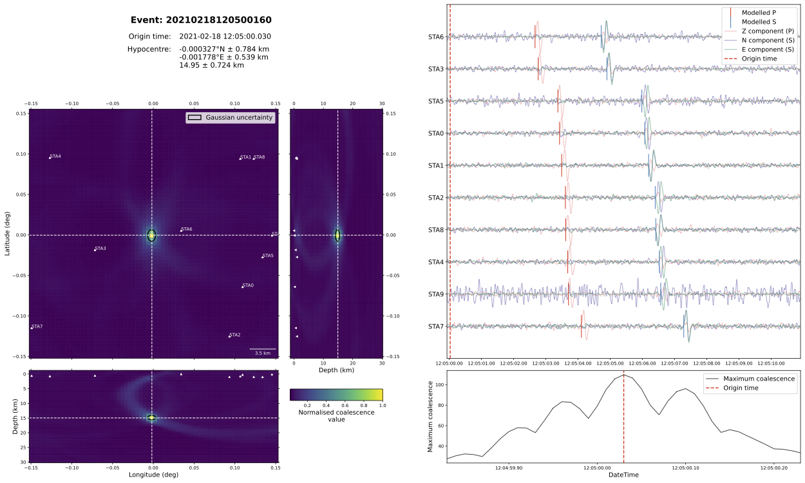

Running locate
==============

The final stage to run is Locate, in which we repeat the migration and stacking algorithm as used in Detect, but instead of performing an exhaustive, reduced resolution search of the entire waveform archive, we focus on small snippets of data around the candidate events identified by the Trigger stage. By concentrating on a shorter time period for each scan, we can up the spatial resolution to compute the event origin time, location, and associated uncertainties.

In this instance, we know we have a single event in our input waveform data. The locate script is largely identical to the detect script used earlier, but with a few important differences:

- instead of the "classic" STA/LTA onset function, in which the two time windows are overlapping, we use the "centred" STA/LTA onset function (passed using the ``position`` argument in the code block below). This means the short-term window sits in front of the long-term window, making the two measures independent from one another and thus providing a more rigorous representation of a Gaussian probability distribution function;

.. code-block:: python

    # --- Create new Onset ---
    onset = STALTAOnset(position="centred", sampling_rate=100)
    onset.phases = ["P", "S"]
    onset.bandpass_filters = {"P": [1, 10, 2], "S": [1, 10, 2]}
    onset.sta_lta_windows = {"P": [0.1, 1.5], "S": [0.1, 1.5]}

- we can also perform some post-location analyses, including phase arrival time picking (note: these are not used in the location, but instead the location estimate produced by the migration and stacking technique is used as a guide for an automated picking algorithm), and magnitude estimates (though this is not implemented here—for an example, please refer to the Iceland volcano-tectonic example).

.. code-block:: python

    # --- Create new PhasePicker ---
    picker = GaussianPicker(onset=onset)
    picker.plot_picks = True

The only remaining parameter to tune is the ``marginal_window``. This determines the length of time over which the 4-D (3 of space, 1 of time) coalescence function is marginalised in order to produce an estimate of the 3-D probability distribution function for the event location. This is then used to produce both the best-estimate location and the associated spatial uncertainty.

Locate can be run in two slightly different ways: either by passing a start and end time, meaning only candidate events in this time period will be located; or by passing a triggered events ``.csv`` file. In this way, one can pre-filter the candidate event catalogue by some criteria to reduce the number of events being located.

There are a number of additional outputs that can be enabled, including plotting utilities (which will, naturally, increase the amount of time taken to run the Locate stage). As with the other stages, some status information is output to the standard output stream and a log file.

For the synthetic example, we can see in the below summary plot that we recover an earthquake location that corresponds closely with the (0.0, 0.0, 15 km) input location, and 12:05:00.0 input origin time.

The full script looks like this:

.. code-block:: python

    """
    This script runs the locate stage for the synthetic example described in the tutorial
    in the online documentation. 

    :copyright:
        2020–2024, QuakeMigrate developers.
    :license:
        GNU General Public License, Version 3
        (https://www.gnu.org/licenses/gpl-3.0.html)

    """

    from quakemigrate import QuakeScan
    from quakemigrate.io import Archive, read_lut, read_stations
    from quakemigrate.signal.onsets import STALTAOnset
    from quakemigrate.signal.pickers import GaussianPicker

    # --- i/o paths ---
    station_file = "./inputs/synthetic_stations.sta"
    data_in = "./inputs/mSEED"
    lut_out = "./outputs/lut/example.LUT"
    run_path = "./outputs/runs"
    run_name = "example_run"

    # --- Set time period over which to run locate ---
    starttime = "2021-02-18T12:03:50.0"
    endtime = "2021-02-18T12:06:10.0"

    # --- Read in station file ---
    stations = read_stations(station_file)

    # --- Create new Archive and set path structure ---
    archive = Archive(
        archive_path=data_in, stations=stations, archive_format="YEAR/JD/STATION"
    )

    # --- Load the LUT ---
    lut = read_lut(lut_file=lut_out)

    # --- Create new Onset ---
    onset = STALTAOnset(position="centred", sampling_rate=100)
    onset.phases = ["P", "S"]
    onset.bandpass_filters = {"P": [1, 10, 2], "S": [1, 10, 2]}
    onset.sta_lta_windows = {"P": [0.1, 1.5], "S": [0.1, 1.5]}

    # --- Create new PhasePicker ---
    picker = GaussianPicker(onset=onset)
    picker.plot_picks = True

    # --- Create new QuakeScan ---
    scan = QuakeScan(
        archive,
        lut,
        onset=onset,
        picker=picker,
        run_path=run_path,
        run_name=run_name,
        log=True,
        loglevel="info",
    )

    # --- Set locate parameters ---
    scan.marginal_window = 1.5
    scan.threads = 4  # NOTE: increase as your system allows to increase speed!

    # --- Toggle plotting options ---
    scan.plot_event_summary = True

    # --- Toggle writing of waveforms ---
    scan.write_cut_waveforms = True

    scan.write_marginal_coalescence = True

    # --- Run locate ---
    scan.locate(starttime=starttime, endtime=endtime)
