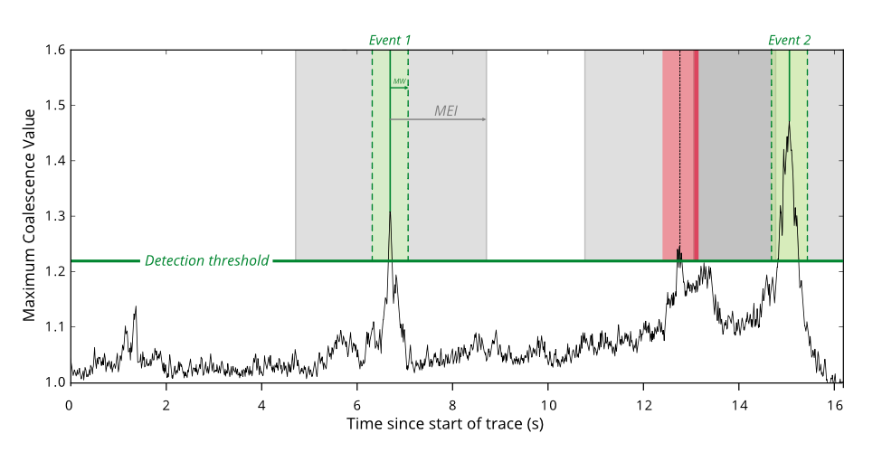
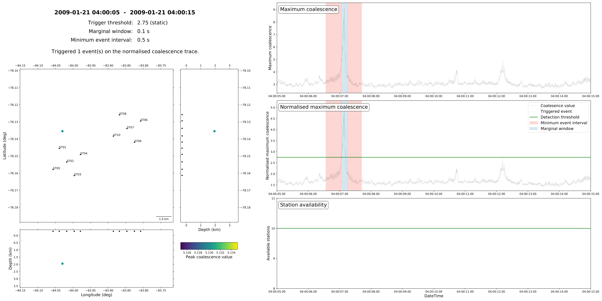

The Trigger Stage
=================
This tutorial covers the basic ideas and definitions underpinning the intermediate stage of a QuakeMigrate—Trigger.

In this stage, a triggering algorithm is used on the ``scanmseed`` output from Detect to identify potential events. These potential origin times are then passed to Locate for relocation, output and further analysis.

Before you start
----------------
Trigger uses only the output from a previous Detect run and the accompanying lookup table (LUT). These are specified as below.

::

    from quakemigrate.io import read_lut

    lut_file = "./outputs/lut/example.LUT"
    run_path = "./outputs/runs"
    run_name = "example_run"

    # --- Set time period over which to run trigger ---
    starttime = "2014-06-29T18:41:55.0"
    endtime = "2014-06-29T18:42:20.0"

    # --- Load the LUT ---
    lut = read_lut(lut_file=lut_file)

.. note:: Your ``run_path`` and ``run_name`` variables should be identical to those used in the Detect run. QuakeMigrate will automatically generate suitable output directories for the output from Trigger.

The ``starttime`` and ``endtime`` variables do not have to be the same as the Detect run. You can experiment with your Trigger parameters on smaller time periods (which may or may not contain earthquakes) before running the entire time period.

Initialising the Trigger object
-------------------------------

::

    from quakemigrate.signal import Trigger

    trig = Trigger(
        lut,
        run_path=run_path,
        run_name=run_name,
        log=True,
        loglevel="info"
    )

    trig.marginal_window = 1.
    trig.min_event_interval = 6.
    trig.normalise_coalescence = True

The :class:`Trigger` object is initialised above with the LUT and run-naming variables. Three parameters should be set to optimise results.

The ``normalise_coalesence`` argument defines whether you wish to use the coalescence or the normalised coalescence traces to perform the triggering. While there is typically little difference between the two traces, experience has found that using the normalised coalescence is normally the better choice. This is because the ``STALTAOnset`` function reaches a minimum directly after high signal-to-noise ratio events. This can act to mask small aftershocks that can occur either within or directly after the coda of the large event. By normalising the coalescence by the average 3D-grid coalescence, this effect is reduced.

The ``marginal_window`` and ``min_event_interval`` parameters control the minimum time interval (in seconds) allowed between successive triggered earthquakes. The algorithm proceeds by first identifying all time periods where the coalescence is greater than the threshold (see below for how to select this). The candidate event origin time is then defined as the position of maximum coalescence in each candidate period. These candidate origin times are then filtered such that the ``marginal_window`` around a candidate origin time is not within the ``min_event_inteval`` of another event. If this does occur, the larger of the two candidates is preserved for the next stage. This is displayed schematically in the figure below. The ``marginal_window`` around the second triggered event overlaps with the ``min_event_window`` around the third triggered event. As the second peak is lower than the third, the second triggered event is removed.

These two parameters can have large consequences in the results output from Trigger. You can experiment with the effect they have on your final results by running small-time periods of data through detect and setting ``interactive_plot=True`` (see below). After running, Trigger will open a :mod:`matplotlib` figure showing the size of the ``marginal_window`` and ``min_event_interval`` around each triggered event, allowing you to fine-tune your chosen values.

A good rule-of-thumb is that the length of the ``marginal_window`` should be an estimate of the error in origin time due to the expected spatial error of your seismicity and error in the velocity model. For example, an earthquake with an expected spatial error of 2.5 km, a reasonable error in the velocity model of 0.2 km s-1 and a network station spacing of 20 km would have a total error of ~1 s. The ``min_event_interval`` parameter depends on the seismicity which you are trying to image. For many tectonic settings, 30 s would be reasonable. However, during a dyke intrusion or other seismic crisis you may want to reduce this number as events can occur very frequently.

Choosing a detection threshold
------------------------------
The detection threshold is the most important parameter for determining the number of triggers that are passed to the Locate stage. Choosing a “good” value will mean a low number of false positives while maximising the number of detected earthquakes. QuakeMigrate has two options for deciding how to calculate the threshold: a static or dynamic threshold. These are discussed below. To decide which values and method to use, you should experiment with your own data using the ``interactive_plot=True`` keyword argument (see below).

For many situations, a static threshold is sufficient as the background noise is fairly constant. If however, your seismic network suffers from large changes in the noise levels with time (i.e., due to anthropogenic noise) or you wish to automatically raise the detection threshold during seismic swarms you may wish to experiment with using the dynamic options.

Static Threshold
################

::

    # --- Static threshold ---
    trig.threshold_method = "static"
    trig.static_threshold = 1.8

Does exactly as it says on the tin. You decide a number and events are triggered if the coalescence value exceeds this number. 

Dynamic Threshold
#################

::

    # --- Dynamic (Median Absolute Deviation) threshold ---
    trig.threshold_method = "mad"
    trig.mad_window_length = 7200.
    trig.mad_multiplier = 8.

In this method, the threshold value is chosen based on the median absolute deviation (MAD) of the coalescence function. The ``mad_window_length`` parameter controls the window (in seconds) which the MAD is calculated over. The ``mad_multiplier`` parameter is the multiplier applied to the MAD value which sets the threshold for that time window.

The calculation of the MAD can be time-consuming if the window length is small. Typically, you should not need to reduce the window below 1 hour (i.e., 3600 s) to accurately capture the change in seismic noise levels, but ultimately it depends on the timescale over which you expect to see changes in noise.

Running Trigger
---------------

::

    trig.trigger(starttime, endtime, interactive_plot=False)

Trigger runs for a time period between the defined start and end times. A single keyword argument (``interactive_plot``) can be used to open an interactive figure as well as saving the trigger summaries to file. For full trigger runs, it is recommended this is turned off.

Understanding the Trigger output
--------------------------------
Trigger makes two outputs along with the optional logfiles: a list of event triggers in a .csv file and a summary figure.

Event trigger file
##################
This is a simple .csv file which contains the events triggered during this run of Trigger. In the .csv file the unique event id (based on the origin time), the location, and the coalescence values on both the normalised and raw coalescence traces are saved. This file is used as an input for the Locate stage.

Trigger summary figure
######################
This figure contains a number of panels which summarises the results of the Trigger stage. It is useful to check these figures when checking that your Trigger parameters are reasonable.

On the left of the figure is a map view and 2 cross-sections showing the location of the triggered events (circles) in relation to your seismic network (triangles). The events are coloured by their peak coalescence value by the displayed colourmap. The bottom panel on the right-hand side shows the number of stations available during your chosen time window. Above this are two panels showing the normalised (middle) and non-normalised (top) coalescence functions. Your chosen detection threshold will be shown as a green line on whichever coalescence function you performed the triggering on (in this example, the normalised trace). Triggered events will be indicated by vertical lines with their accompanying marginal window and minimum event interval.
